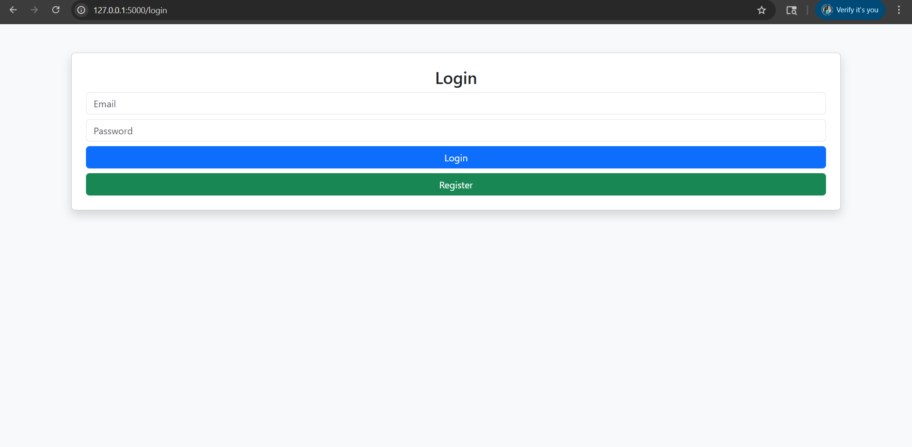
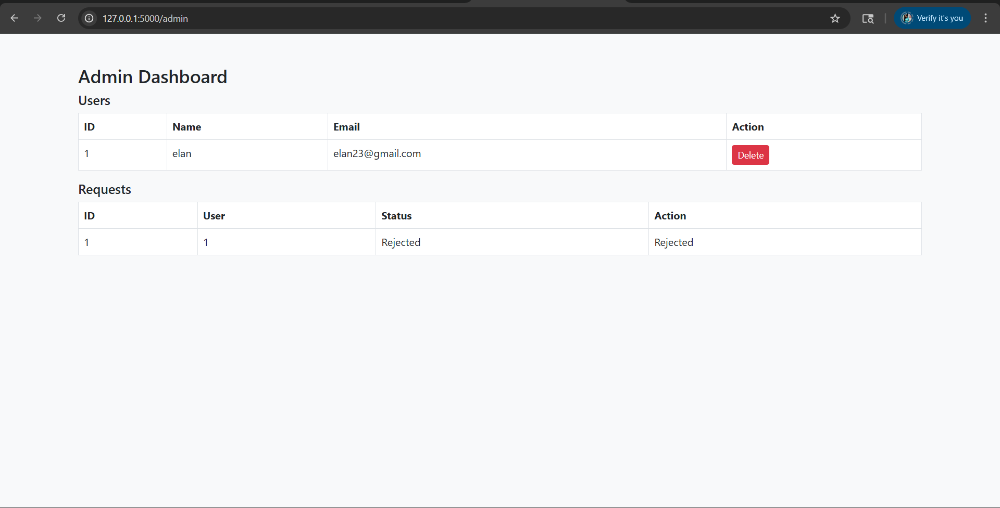

# Data Privacy Management System

A web-based application that allows users to manage their personal data privacy by submitting account deletion requests, which are processed through an admin approval workflow.

---

## Features

- User Registration and Login  
- Secure Session Handling  
- Account Deletion Request System  
- Request Status Tracking (Pending / Approved / Rejected)  
- Admin Dashboard  
- Approve / Reject User Requests  
- Delete User Accounts from Database  

---

## Project Concept

This system simulates a real-world data privacy workflow, where users can request deletion of their data, and an administrator reviews and processes those requests.

It reflects how modern applications handle:
- User data control  
- Privacy compliance  
- Request-based data management  

---

## Tech Stack

- Backend: Python (Flask)  
- Database: SQLite  
- Frontend: HTML, CSS  
- Tools: VS Code, Git, GitHub  

---

## Project Structure


Data-Privacy-Management-System/
│
├── app.py
├── database.py
├── README.md
├── .gitignore
│
├── static/
│ └── style.css
│
├── templates/
│ ├── admin.html
│ ├── dashboard.html
│ ├── home.html
│ ├── login.html
│ ├── register.html
│
└── docs/
├── Requirement_Analysis.docx
└── System_Design.docx
---

## How to Run the Project

1. Clone the repository:
   ```bash
   git clone https://github.com/lathika-25/data-privacy-management-system.git

Navigate to the project folder:
   cd data-privacy-management-system

Create the database:
   python database.py

Run the application:
    python app.py

Open in browser:
    http://127.0.0.1:5000
## Screenshots

### Login Page


### User Dashboard


### Admin Panel


Future Improvements
 - Implement password hashing for better security
 - Add email notifications for request updates
 - Improve UI/UX design
 - Deploy the application

Conclusion
This project demonstrates a complete workflow-based system with user and admin roles, focusing on data privacy and request management. It showcases backend development, database handling, and role-based access control.

Author
Lathika
GitHub: https://github.com/lathika-25
    
